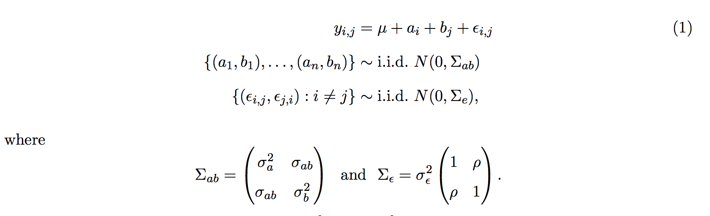
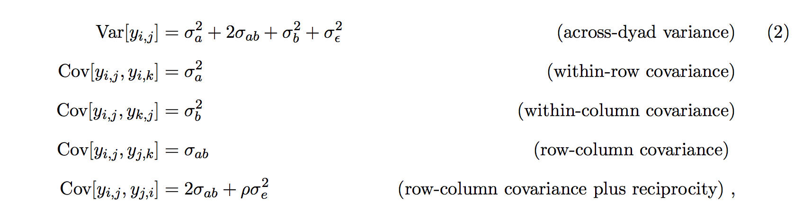
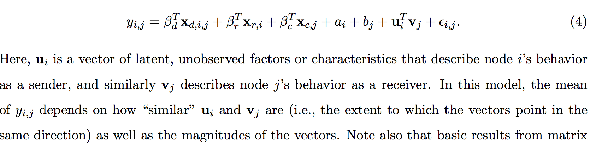
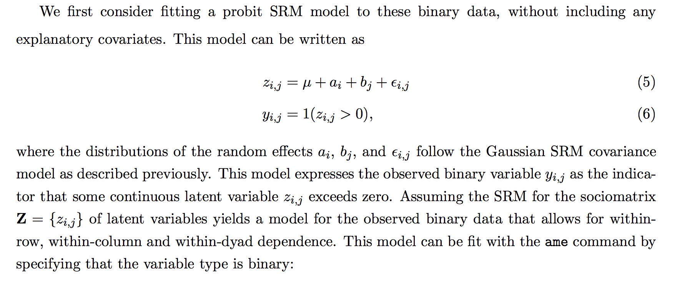

```{r setup, include=FALSE}
knitr::opts_chunk$set(echo = TRUE)
```

##Social Relations Model
A running example in this section will be an analysis of international trade data, where yi,j is the (log) dollar-value of exports from country i to country j. These data can be obtained from the IR90s dataset included in the amen package. Specifically, we will analyze trade data between the 30 countries having the highest GDPs:

```{r}
library(amen)
data(IR90s)
gdp<-IR90s$nodevars[,2]
topgdp<-which(gdp>=sort(gdp,decreasing=TRUE)[30] )
Y<-log( IR90s$dyadvars[topgdp,topgdp,2] + 1 )
```





The ``amen`` package provides model fitting and evaluation tools for the SRM via the default values of the ``ame`` command:

```{r message=F ,results="hide"}
fit_SRM<-ame(Y,plot=F)
```

Get the posterior mean:
```{r}
mean(fit_SRM$BETA)
apply(fit_SRM$VC[,1:3],2,mean)# model-based estimate
mean(fit_SRM$VC[,4]) # model-based estimate
```

##Social relations regression modeling


We illustrate parameter estimation for the SRRM by fitting the model to the trade data. Nodal covariates include (log) population, (log) GDP, and polity, a measure of democracy. Dyadic covariates include the number the number of conflicts, (log) geographic distance between countries, the number of shared IGO memberships, and a polity interaction (the product of the nodal polity scores).

```{r}
dimnames(IR90s$nodevars)[[2]]
Xn<-IR90s$nodevars[topgdp,]
Xn[,1:2]<-log(Xn[,1:2])
dimnames(IR90s$dyadvars)[[3]]
Xd<-IR90s$dyadvars[topgdp,topgdp,c(1,3,4,5)]
Xd[,,3]<-log(Xd[,,3])
```

The SRRM can be fit by specifying the covariates in the ``ame`` function:

```{r message=F ,results="hide"}
fit_srrm<-ame(Y,Xd=Xd,Xr=Xn,Xc=Xn,plot=F)
```


Posterior mean estimates, standard deviations, nominal z-scores and p-values may be obtained with the ``summary`` command:

```{r}
summary(fit_srrm)
```

It is instructive to compare these results to those that would be obtained under an ordinary
linear regression model that assumes i.i.d. residual standard error. Such a model can be fit in the amen package by opting to fit a model with no row variance, column variance or dyadic correlation:

```{r message=F ,results="hide"}
fit_rm<-ame(Y,Xd=Xd,Xr=Xn,Xc=Xn,rvar=FALSE,cvar=FALSE,dcor=FALSE,plot=F)
```

```{r}
summary(fit_rm)
```


##Transitivity and stochastic equivalence via multiplicative effects



```{r results="hide"}
fit_ame2<-ame(Y,Xd,Xn,Xn,R=2,plot=F)
```

```{r}
summary(fit_ame2)
```

##AME models for binary data

For example, the ``amen`` dataset ``lazegalaw`` includes a social network of friendship ties between 71 members of a law firm, along with data on two other dyadic variables and several nodal variables. The friendship data are displayed as a graph in Figure 8, where the nodes are colored according to each lawyer’s office location.

```{r}
data(lazegalaw)
Y<-lazegalaw$Y[,,2]
Xd<-lazegalaw$Y[,,-2]
Xn<-lazegalaw$X
dimnames(Xd)[[3]]
dimnames(Xn)[[2]]
netplot(lazegalaw$Y[,,2],ncol=Xn[,3])
```





```{r results="hide"}
fit_SRM<-ame(Y,model="bin",plot=F)
```

```{r}
summary(fit_SRM)
```


We next consider a probit SRRM that includes the SRM terms and linear regression effects for some nodal and dyadic covariates.

```{r results="hide"}
Xno<-Xn[,c(1,2,4,5,6)]
fit_SRRM<-ame(Y, Xd=Xd, Xr=Xno, Xc=Xno, model="bin",plot=F)
```

```{r}
summary(fit_SRRM)
```

For a model with a rank-3 multiplicative effect:
```{r results="hide"}
fit_AME<-ame(Y, Xd=Xd[,,2], R=3, model="bin",plot=F)
```

Associations between multiplicative effects and categorical variables can be examined via plots.

```{r}
U<-fit_AME$U
V<-fit_AME$V
round(cor(U, Xno),2)
round(cor(V, Xno),2)
```

